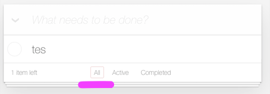

# Zadania 

Korzystajac z aplikacji: https://todomvc.com/examples/vanilla-es6/ napisz do niej kilka testow polegajacych na sprawdzeniu czy:

1) Po wejsciu na stronie widoczny jest naglowek (h1) bez sprawdzania jaki ma napis w srodku. Po prostu czy jest widoczny

2) Czy po dodaniu jednego nowego elementu, w stopce znajduje sie odpowiednie podsumowanie
   
   
3) Czy po dodaniu jednego nowego elementy w stopce sa widoczne trzy przyciski: `All`, `Active`, `Completed`
   

4) Czy dodajac drugi nowy element w stopce znajduje sie odpowiednie podsumowanie (podobne zadanie do 3 jest tu chcemy sprawdzic czy iteruje sie poprawnie - wiec mozesz dodac kilka nowych `todosow`)

5) Czy po kliknieciu na `todo item` zmieni on swoj `stan` na zaznaczony.
   
Hint: Zwroc uwage na to, ze to przekreslenie jest dzieki temu ze po kliknieciu zostaje nadana klasa `.completed`
   
   Wiec musisz kliknac w ten element i potem sprawdzic czy ten element ma taka clase (`have.class`)
   
6) Czy kiedy masz dodany jeden `todo item`, i przejdziesz do zakladki `Completed` to czy tam nie masz zadnego elementu.
   
   
   
----

## Przydatne linki: 
asercje: 
https://docs.cypress.io/api/commands/should#Syntax

selektory css: 
https://code.tutsplus.com/pl/tutorials/the-30-css-selectors-you-must-memorize--net-16048
